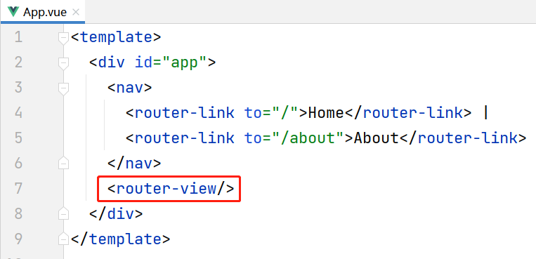

# 30. 关于VUE Cli

VUE Cli：Vue脚手架

在Vue脚手架项目中，使用的是“单页面”的设计模式，也就是说，整个项目中只有1个HTML，而这个HTML是由多个不同的视图组合而成的，每个视图都是可以随时替换为其它视图的，并且，每个视图都由独立的文件来开发。

关于Node.js的安装、VUE Cli的安装，请参考《VUE Cli课前准备_软件安装篇》教程。

# 31. 修改VUE Cli项目的端口号

打开项目下的`package.json`，原本有以下代码片段：

```json
"scripts": {
    "serve": "vue-cli-service serve",
    "build": "vue-cli-service build"
},
```

将以上`serve`属性的值后面添加`--port 指定的端口号`即可修改端口号，例如：

```json
"scripts": {
    "serve": "vue-cli-service serve --port 9000",
    "build": "vue-cli-service build"
},
```

修改完后，重新启动项目，即可看到占用了`9000`端口。

# 32. Vue脚手架项目的结构

Vue脚手架项目的结构：

- `[.idea]`：只要是使用IntelliJ IDEA打开的项目，都会生成此文件夹，是IntelliJ IDEA管理项目时使用到的相关文件，此文件夹不应该手动修改，如果此文件夹中出现错误，将此文件夹删除即可，后续IntelliJ IDEA会自动重新创建此文件夹及内部的文件
- 【★】`[node_modules]`：当前项目中的依赖项文件所在的文件夹（Vue脚手架项目的依赖项都在当前项目中，不像Java项目的依赖项统一在`.m2\repository`下），此文件夹不应该手动修改，在使用GIT管理项目时，此文件夹通常会被配置到`.gitignore`文件夹，以至于此文件夹不会被提交到GIT服务器，当从其它电脑上拉取项目时，也不会得到此文件夹及内部的文件，则项目是不可以运行的，需要在项目文件夹下执行`npm install`命令，会自动创建此文件夹，并根据`package.json`中配置的依赖项来下载所需的所有依赖项
- 【★】`[public]`：静态资源文件夹，通常存放`.css`文件、`.js`文件、图片等，也可以自行创建文件夹来管理相关文件，当项目启动后，可以以此文件夹作为URL的根路径来访问相关静态资源
  - `favicon.ico`：图标文件，此图标通常会显示在浏览器的标签栏、收藏夹等位置，此文件的名称是固定的，如果要更换图标文件，必须使用新文件覆盖此文件，文件名不变
  - `index.html`：是当前项目中唯一的`.html`文件，默认会显示此文件，通常不编辑此文件
- `[src]`：项目的源文件文件夹
  - `[assets]`：资源文件夹，也可以用于存放`.css`文件、`.js`文件、图片等，与`[public]`不同的地方在于此文件是在编译范围之内的，此文件夹下的文件在使用时，应该是不随着程序运行而发生变化的
  - `[components]`：视图组件文件夹，通常用于存放`.vue`文件
  - 【★】`[router]`：路由配置文件夹
  - `[store]`：公共存储的数据的文件夹
  - 【★】`[views]`：一般视图组件的文件夹，通常用于存放`.vue`文件
  - 【★】`App.vue`：默认已经绑定到`index.html`的视图组件，可以理解为是任何一个页面的显示入口
  - 【★】`main.js`：项目的主配置文件，例如当安装了某个新的软件（添加了新的依赖）后，可能需要在此文件中添加一些配置
- `.gitignore`：所有使用GIT管理项目都有此文件，用于配置GIT应该“忽略”的文件或文件夹
- `babel.config.js`：是Babel的配置文件，学习初期不关注此文件
- `jsconfig.json`：是JavaScript的配置文件，学习初期不关注此文件
- 【★】`package.json`：当前项目的配置文件，在创建项目时需要指定此文件作为配置文件，此文件中主要配置了npm命令的相关脚本、当前项目的依赖项
- `package-lock.json`：是锁定的配置文件，是根据`package.json`自动生成的，不可手动修改
- `LICENSE`：项目是授权许可文件，当把项目提交到GIT并开源时，需要选择某个开源协议，就会生成此文件
- `README.md`：项目的介绍性文件，当第1次打开此项目，或在GITEE主页上，都会显示此文件的内容
- `vue.config.js`：是Vue的配置文件，学习初期不关注此文件

# 33. 关于`<router-view/>`标签

在默认的`App.vue`文件中，源代码中有`<router-view/>`标签：



此标签表示**此处将由别的视图组件来完成显示**！具体由哪个视图来显示，取决于当前访问的URL在`src/router/index.js`中的`routes`常量中对应的配置！默认的配置如下：

```javascript
const routes = [
  {
    path: '/',
    name: 'home',
    component: HomeView
  },
  {
    path: '/about',
    name: 'about',
    component: () => import('../views/AboutView.vue')
  }
]
```

可以看到，以上配置的是路由中的绑定关系，即根路径`/`绑定了`HomeView`视图组件，而`/about`路径绑定了`AboutView`视图组件，所以，在`App.vue`中的`<router-view>`会根据实际访问的URL选择性的显示`HomeView`或`AboutView`中的内容！


